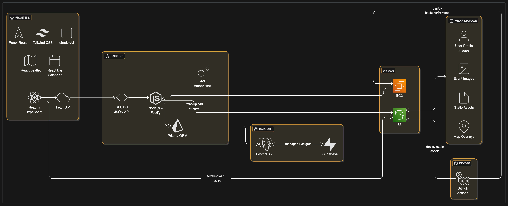
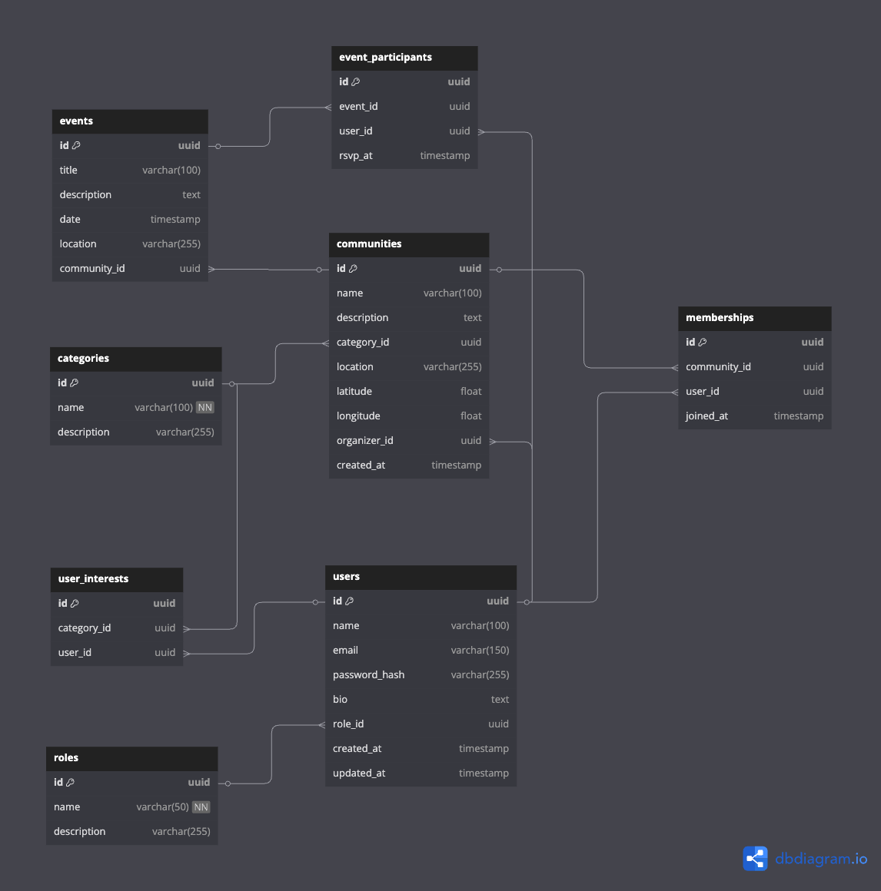

# Find a Community

## 📌 Project Overview

**Find a Community** is a responsive web app designed to help newcomers in Vancouver (and eventually other cities) quickly find local groups aligned with their interests — whether it's a church, a volleyball team, a language exchange circle, or a study group.

When I first moved to Vancouver, I wanted to find a Brazilian church — but I had no idea where to look. Like many newcomers, I ended up scrolling through Facebook, asking in WhatsApp groups, and hoping someone would point me in the right direction.

Event sites like Meetup are helpful, but they mostly focus on one-time events and make it hard to find ongoing or regular communities.  
**Find a Community** solves this by offering one simple place to search, join, and stay updated on groups you care about. In the future, an AI feature will suggest communities based on your profile and bio.

---

## 🧭 Big Picture (High-Level Architecture)

The diagram below illustrates the overall system architecture, including the interaction between the frontend, backend, database, and deployment services.



Key components:
- **Frontend**: React + Tailwind, runs in the browser, calls backend APIs.
- **Backend**: Node.js (Fastify) handles business logic and API endpoints.
- **Database**: PostgreSQL managed via Prisma ORM, hosted on Supabase.
- **Authentication**: JWT-based auth flows between frontend and backend.
- **Hosting**: Deployed on AWS (EC2 for backend/frontend, S3 for static assets).
- **CI/CD**: GitHub Actions for build/test/deploy.

---

## 🛠 Technology Stack

### Frontend
- React + TypeScript  
- React Router  
- Tailwind CSS + shadcn/ui  
- React Big Calendar  
- React Leaflet  
- Fetch API

### Backend
- Node.js (Fastify + TypeScript)  
- PostgreSQL (via Prisma ORM)  
- RESTful API  
- JWT for authentication

### DevOps & Hosting
- GitHub Actions (CI/CD)  
- AWS EC2 + S3  
- Supabase for PostgreSQL hosting

---

## 🧩 Database Schema

This repository includes the **Entity-Relationship (ER) Diagram** and database schema for the application.

The schema was designed to support:
- User registration and interest tracking
- Community and event management
- User participation (joining communities and confirming attendance for events)
- Role-based permissions (user, organizer, admin)
- Support for future AI-driven recommendations

### ✅ Tables

- `users`
- `roles`
- `categories`
- `user_interests`
- `communities`
- `events`
- `memberships`
- `event_participants`

> ER diagram generated with [dbdiagram.io](https://dbdiagram.io/d/FSWD-Find-a-Community-6838d1a6bd74709cb72b3376) is available as an image in this repository.



---

## ✍️ API Contract

This section defines the API endpoints, request/response formats, and authorization needs for the **Find a Community** application.

### General Considerations

*   **Base URL:** `/api` (All endpoints below will be prefixed with this)
*   **Authentication:** JWT (JSON Web Token) sent in the `Authorization` header as `Bearer <token>`.
*   **Request/Response Format:** JSON
*   **HTTP Status Codes:**
    *   `200 OK`: Successful GET, PUT, PATCH request.
    *   `201 Created`: Successful POST request (resource created).
    *   `204 No Content`: Successful DELETE request or successful PUT/PATCH with no body returned.
    *   `400 Bad Request`: Invalid request payload or parameters.
    *   `401 Unauthorized`: Missing or invalid authentication token.
    *   `403 Forbidden`: Authenticated user does not have permission to access the resource.
    *   `404 Not Found`: Resource not found.
    *   `500 Internal Server Error`: Server-side error.
*   **Error Response Format:**
    ```json
    {
      "error": "Short error message",
      "details": "Optional longer description or validation errors"
    }
    ```
*   **Pagination:** For list endpoints, use query parameters `page` (default 1) and `limit` (default 10). Responses will include pagination metadata:
    ```json
    {
      "data": "[...]",
      "pagination": {
        "currentPage": 1,
        "totalPages": 5,
        "totalItems": 48,
        "limit": 10
      }
    }
    ```

---

### 1. Authentication (`/auth`)

#### 1.1. User Registration
*   **Endpoint:** `POST /auth/register`
*   **Description:** Creates a new user account.
*   **Authorization:** Public
*   **Request Body:**
    ```json
    {
      "name": "Kaynan Camargo",
      "email": "kaynansc@gmail.com",
      "password": "securePassword123"
    }
    ```
*   **Success Response (201 Created):**
    ```json
    {
      "userId": "uuid-user-123",
      "name": "Kaynan Camargo",
      "email": "kaynansc@gmail.com",
      "message": "User registered successfully. Please login."
    }
    ```
    *(Alternatively, you can return a JWT token directly upon registration if you auto-login them)*

#### 1.2. User Login
*   **Endpoint:** `POST /auth/login`
*   **Description:** Authenticates a user and returns a JWT.
*   **Authorization:** Public
*   **Request Body:**
    ```json
    {
      "email": "kaynansc@gmail.com",
      "password": "securePassword123"
    }
    ```
*   **Success Response (200 OK):**
    ```json
    {
      "token": "jwt.token.string",
      "userId": "uuid-user-123",
      "name": "Kaynan Camargo",
      "role": "user" // or "organizer", "admin"
    }
    ```

---

### 2. Users (`/users`)

#### 2.1. Get Current User Profile
*   **Endpoint:** `GET /users/me`
*   **Description:** Retrieves the profile of the currently authenticated user.
*   **Authorization:** Authenticated User
*   **Success Response (200 OK):**
    ```json
    {
      "id": "uuid-user-123",
      "name": "Kaynan Camargo",
      "email": "kaynansc@gmail.com",
      "bio": "Loves hiking and coding.",
      "interests": ["uuid-category-1", "uuid-category-2"], // Array of category IDs
      "role": "user", // or "organizer", "admin"
      "createdAt": "2025-10-27T10:00:00Z"
    }
    ```

#### 2.2. Update Current User Profile
*   **Endpoint:** `PUT /users/me`
*   **Description:** Updates the profile of the currently authenticated user.
*   **Authorization:** Authenticated User
*   **Request Body:** (Fields are optional)
    ```json
    {
      "name": "Kaynan Sampaio",
      "bio": "Newcomer to Vancouver, loves hiking, coding, and Brazilian churches.",
      "interests": ["uuid-category-1", "uuid-category-3"] // Array of category IDs
    }
    ```
*   **Success Response (200 OK):**
    ```json
    {
      "id": "uuid-user-123",
      "name": "Kaynan Sampaio",
      "email": "kaynansc@gmail.com",
      "bio": "Newcomer to Vancouver, loves hiking, coding, and Brazilian churches.",
      "interests": ["uuid-category-1", "uuid-category-3"],
      "role": "user",
      "updatedAt": "2025-10-27T11:00:00Z"
    }
    ```

---

### 3. Categories (`/categories`)

#### 3.1. List All Categories
*   **Endpoint:** `GET /categories`
*   **Description:** Retrieves a list of all available interest categories.
*   **Authorization:** Public
*   **Success Response (200 OK):**
    ```json
    {
      "data": [
        { "id": "uuid-category-1", "name": "Churches" },
        { "id": "uuid-category-2", "name": "Sports" },
        { "id": "uuid-category-3", "name": "Language Exchange" }
      ]
      // Potentially pagination if the list is very long
    }
    ```

---

### 4. Communities (`/communities`)

#### 4.1. Search and Filter Communities
*   **Endpoint:** `GET /communities`
*   **Description:** Lists communities, with filtering and searching capabilities.
*   **Authorization:** Public
*   **Query Parameters:**
    *   `search` (string): Keyword search (name, description).
    *   `category` (uuid): Filter by category ID.
    *   `lat` (float), `lon` (float), `distance` (int, in km/miles): Filter by location.
    *   `page` (int), `limit` (int): For pagination.
*   **Success Response (200 OK):**
    ```json
    {
      "data": [
        {
          "id": "uuid-community-1",
          "name": "Vancouver Brazilian Church",
          "description": "A welcoming church for the Brazilian community.",
          "categoryId": "uuid-category-1",
          "categoryName": "Churches", // Denormalized for convenience
          "location": { "lat": 49.2827, "lon": -123.1207, "address": "123 Main St, Vancouver" },
          "organizerId": "uuid-user-organizer-1",
          "bannerImageUrl": "url/to/image.jpg",
          "memberCount": 50 // Example derived data
        }
        // ... more communities
      ],
      "pagination": { ... }
    }
    ```

#### 4.2. Create a New Community
*   **Endpoint:** `POST /communities`
*   **Description:** Organizer of this Community / Admin.
*   **Authorization:** Authenticated User
*   **Request Body:**
    ```json
    {
      "name": "Downtown Volleyball Meetup",
      "description": "Weekly volleyball games for all skill levels.",
      "categoryId": "uuid-category-2",
      "location": { "lat": 49.2700, "lon": -123.1100, "address": "English Bay Beach Courts" },
      "meetingSchedule": "Saturdays at 2 PM", // Text description or more structured data
      "contactEmail": "volley@example.com",
      "bannerImageUrl": "url/to/optional/image.jpg"
    }
    ```
*   **Success Response (201 Created):**
    ```json
    {
      "id": "uuid-community-2",
      "name": "Downtown Volleyball Meetup",
      "description": "Weekly volleyball games for all skill levels.",
      "categoryId": "uuid-category-2",
      "location": { "lat": 49.2700, "lon": -123.1100, "address": "English Bay Beach Courts" },
      "meetingSchedule": "Saturdays at 2 PM",
      "contactEmail": "volley@example.com",
      "bannerImageUrl": "url/to/optional/image.jpg",
      "organizerId": "uuid-user-123", // ID of the user who created it
      "createdAt": "2025-10-27T12:00:00Z"
    }
    ```

#### 4.3. Get Community Details
*   **Endpoint:** `GET /communities/{communityId}`
*   **Description:** Retrieves detailed information about a specific community.
*   **Authorization:** Public
*   **Success Response (200 OK):**
    ```json
    {
      "id": "uuid-community-1",
      "name": "Vancouver Brazilian Church",
      "description": "A welcoming church for the Brazilian community. We meet every Sunday for service, followed by fellowship.",
      "categoryId": "uuid-category-1",
      "categoryName": "Churches",
      "location": { "lat": 49.2827, "lon": -123.1207, "address": "123 Main St, Vancouver" },
      "meetingSchedule": "Sundays at 10 AM",
      "contactEmail": "brazilian.church.van@example.com",
      "bannerImageUrl": "url/to/image.jpg",
      "organizer": {
        "id": "uuid-user-organizer-1",
        "name": "Pastor Silva"
      },
      "upcomingEvents": [ // A few upcoming events, more can be fetched via events endpoint
        { "id": "uuid-event-1", "name": "Sunday Service", "startTime": "2025-11-05T10:00:00Z" },
        { "id": "uuid-event-2", "name": "Bible Study", "startTime": "2025-11-08T19:00:00Z" }
      ],
      "memberCount": 50,
      "isMember": true // Boolean, if authenticated user is a member
    }
    ```

#### 4.4. Update Community Details
*   **Endpoint:** `PUT /communities/{communityId}`
*   **Description:** Updates details of a community.
*   **Authorization:** Organizer of this Community / Admin
*   **Request Body:** (Similar to POST, fields are optional)
    ```json
    {
      "name": "Vancouver Brazilian Evangelical Church",
      "description": "Updated description.",
      // ... other fields
    }
    ```
*   **Success Response (200 OK):** (Updated community object)

#### 4.5. Delete Community
*   **Endpoint:** `DELETE /communities/{communityId}`
*   **Description:** Deletes a community.
*   **Authorization:** Organizer of this Community / Admin
*   **Success Response (204 No Content)**

#### 4.6. Join a Community
*   **Endpoint:** `POST /communities/{communityId}/join`
*   **Description:** Allows an authenticated user to join a community.
*   **Authorization:** Authenticated User
*   **Request Body:** (Empty or optional message)
*   **Success Response (200 OK or 201 Created):**
    ```json
    {
      "message": "Successfully joined the community.",
      "membershipId": "uuid-membership-123"
    }
    ```

#### 4.7. Leave a Community
*   **Endpoint:** `POST /communities/{communityId}/leave` (or `DELETE /communities/{communityId}/members/me`)
*   **Description:** Allows an authenticated user to leave a community.
*   **Authorization:** Authenticated User (must be a member)
*   **Request Body:** (Empty)
*   **Success Response (200 OK or 204 No Content):**
    ```json
    {
      "message": "Successfully left the community."
    }
    ```

#### 4.8. Get Communities for Current User ("My Communities")
*   **Endpoint:** `GET /users/me/communities`
*   **Description:** Retrieves a list of communities the authenticated user has joined.
*   **Authorization:** Authenticated User
*   **Success Response (200 OK):**
    ```json
    {
      "data": [
        {
          "id": "uuid-community-1",
          "name": "Vancouver Brazilian Church",
          "bannerImageUrl": "url/to/image.jpg",
          "upcomingEventCount": 2 // Or a snippet of next event
        }
        // ... other joined communities
      ],
      "pagination": { ... }
    }
    ```

---

### 5. Events (`/events` or nested under `/communities`)

Events are typically tied to a community.

#### 5.1. List Events for a Community
*   **Endpoint:** `GET /communities/{communityId}/events`
*   **Description:** Retrieves events for a specific community.
*   **Authorization:** Public
*   **Query Parameters:**
    *   `startDate` (date-time): Filter events starting after this date.
    *   `endDate` (date-time): Filter events ending before this date.
    *   `page`, `limit`: For pagination.
*   **Success Response (200 OK):**
    ```json
    {
      "data": [
        {
          "id": "uuid-event-1",
          "communityId": "uuid-community-1",
          "name": "Sunday Service",
          "description": "Weekly worship service.",
          "startTime": "2025-11-05T10:00:00Z",
          "endTime": "2025-11-05T11:30:00Z",
          "location": { "lat": 49.2827, "lon": -123.1207, "address": "123 Main St, Vancouver (Community Hall)" },
          "isRecurring": true,
          "recurrenceRule": "FREQ=WEEKLY;BYDAY=SU",
          "attendanceCount": 30,
          "isAttending": false // Boolean, if authenticated user is attending
        }
        // ... more events
      ],
      "pagination": { ... }
    }
    ```

#### 5.2. Create an Event for a Community
*   **Endpoint:** `POST /communities/{communityId}/events`
*   **Description:** Creates a new event for a community.
*   **Authorization:** Organizer of this Community / Admin
*   **Request Body:**
    ```json
    {
      "name": "Special Thanksgiving Dinner",
      "description": "Join us for a special community dinner.",
      "startTime": "2025-11-23T18:00:00Z",
      "endTime": "2025-11-23T20:00:00Z",
      "location": { "lat": 49.2827, "lon": -123.1207, "address": "Community Kitchen" }, // Can be different from community default
      "isRecurring": false,
      "maxAttendees": 50 // Optional
    }
    ```
*   **Success Response (201 Created):** (Created event object)

#### 5.3. Get Event Details
*   **Endpoint:** `GET /events/{eventId}` (Assuming event IDs are globally unique, or `/communities/{communityId}/events/{eventId}`)
*   **Description:** Retrieves details for a specific event.
*   **Authorization:** Public
*   **Success Response (200 OK):** (Full event object, similar to list item but potentially more details)

#### 5.4. Update Event Details
*   **Endpoint:** `PUT /events/{eventId}`
*   **Description:** Updates an event.
*   **Authorization:** Organizer of the Community owning this Event / Admin
*   **Request Body:** (Similar to POST, fields optional)
*   **Success Response (200 OK):** (Updated event object)

#### 5.5. Delete Event
*   **Endpoint:** `DELETE /events/{eventId}`
*   **Description:** Deletes an event.
*   **Authorization:** Organizer of the Community owning this Event / Admin
*   **Success Response (204 No Content)**

#### 5.6. Attendance to an Event
*   **Endpoint:** `POST /events/{eventId}/attendance`
*   **Description:** Allows an authenticated user to Attendance 'yes' for an event.
*   **Authorization:** Authenticated User (preferably a member of the community, or open to public)
*   **Request Body:** (Empty, or optional notes)
*   **Success Response (200 OK or 201 Created):**
    ```json
    {
      "message": "Successfully Attendance to the event.",
      "participationId": "uuid-participation-123"
    }
    ```

#### 5.7. Cancel Attendance to an Event
*   **Endpoint:** `DELETE /events/{eventId}/attendance`
*   **Description:** Allows an authenticated user to cancel their Attendance.
*   **Authorization:** Authenticated User (must have Attendance'd)
*   **Success Response (200 OK or 204 No Content):**
    ```json
    {
      "message": "Attendance cancelled."
    }
    ```

#### 5.8. List Event Participants (for Organizers)
*   **Endpoint:** `GET /events/{eventId}/participants`
*   **Description:** Lists users who have Attendance'd to an event.
*   **Authorization:** Organizer of the Community owning this Event / Admin
*   **Success Response (200 OK):**
    ```json
    {
      "data": [
        { "userId": "uuid-user-123", "name": "Kaynan Camargo", "attendanceAt": "2025-10-28T10:00:00Z" },
        { "userId": "uuid-user-456", "name": "Jane Smith", "attendanceAt": "2025-10-28T11:00:00Z" }
      ],
      "pagination": { ... }
    }
    ```

---

### 6. Organizer Dashboard Specific Endpoints

Many organizer functionalities can be achieved using the above endpoints with appropriate authorization checks. However, some aggregated views might be useful:

#### 6.1. List Communities Managed by Organizer
*   **Endpoint:** `GET /organizer/communities`
*   **Description:** Retrieves a list of communities managed by the currently authenticated organizer.
*   **Authorization:** Authenticated User (who is an organizer)
*   **Success Response (200 OK):**
    ```json
    {
      "data": [
        {
          "id": "uuid-community-1",
          "name": "Vancouver Brazilian Church",
          "memberCount": 50,
          "pendingEventCount": 3 // Example metric
        }
        // ... other managed communities
      ],
      "pagination": { ... }
    }
    ```

#### 6.2. List Members of a Managed Community
*   **Endpoint:** `GET /communities/{communityId}/members`
*   **Description:** Retrieves a list of members for a community managed by the organizer.
*   **Authorization:** Organizer of this Community / Admin
*   **Success Response (200 OK):**
    ```json
    {
      "data": [
        { "userId": "uuid-user-123", "name": "Kaynan Camargo", "email": "kaynansc@gmail.com", "joinedAt": "2025-10-01T10:00:00Z" },
        { "userId": "uuid-user-456", "name": "Jane Smith", "email": "jane.smith@example.com", "joinedAt": "2025-10-02T11:00:00Z" }
      ],
      "pagination": { ... }
    }
    ```
---
